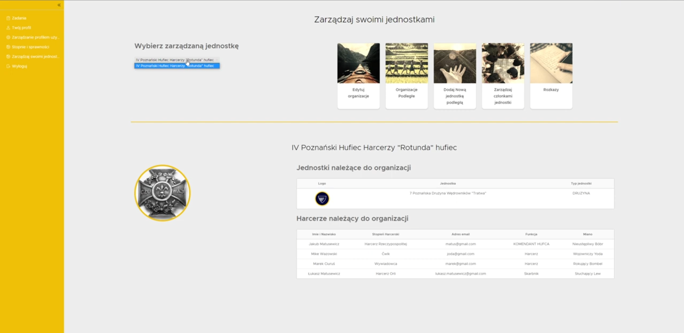
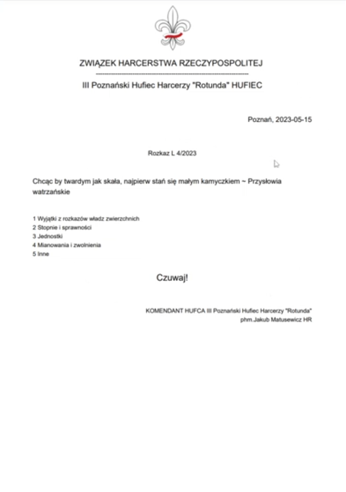
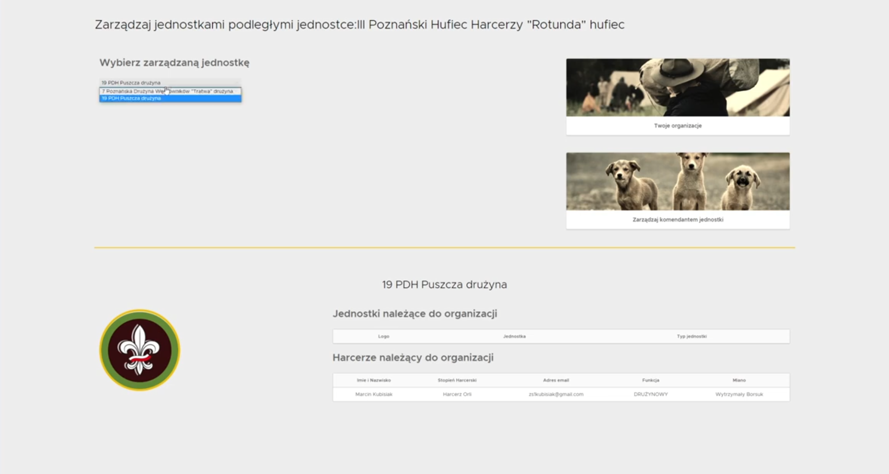

# ScoutMate – Application to make scout instruction live easier

ScoutMate is an application to support scout instructors in their daily work with scout teams. Our main goal was to release sout instructors from all paper work around scout team to aloows them to focuse on eduction young scouts.
To achieve this goal we prepared interface which automate a lot of process which previously documented manually on paper.

## 🔥 Features

✅ **Generating customized PDF documents for orders** - Allows scout instructors to use a simple, efficient interface instead of time-consuming paper work.
✅ **Scalable and easy-to-use organization management system** - Make a space for scout instructora where they can store all information about their: scout troops, scout banners, teams.
✅ **System to create and execute scout attempts** - This feature was added to replace classic paper version of scout attemenpts which very offten were lost. This feature allow users to access their atemtps from any place in any time.
✅ **Dockerized Deployment with Nginx** – Simplified and scalable deployment using containerized environments.
✅ **Secure Authentication & Authorization** – Users can register, log in, and manage their accounts securely.  

## 🚀 Live Demo

🔗 **Try it out here:** **[ScoutMate Demo](https://scoutmate.kubisiak.dev/)**

## 🛠 Tech Stack

### Backend

### Frontend

### Tools & Deployment

## 👥 Contributors

### Backend Development

### Frontend Development

## 🖼 Screenshots

### Home Page

### Product Page

### Shopping Cart

