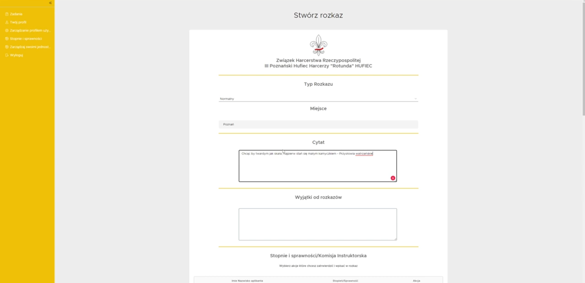

# ScoutMate – Application to Make Scout Instruction Easier ⚜️

ScoutMate is an application designed to support scout instructors in their daily work with scout teams. Our main goal is to relieve scout instructors from all paperwork related to scout teams, allowing them to focus on educating young scouts. To achieve this goal, we have prepared an interface that automates many processes that were previously documented manually on paper.

## 🔥 Features
- ✅ **Generating Customized PDF Documents for Orders:** Allows scout instructors to use a simple, efficient interface instead of time-consuming paperwork.
- ✅ **Scalable and Easy-to-Use Organization Management System:** Provides a space for scout instructors where they can store all information about their scout troops, scout banners, and teams.
- ✅ **System to Create and Execute Scout Attempts:** This feature replaces the classic paper version of scout attempts, which were often lost. It allows users to access their attempts from any place at any time.
- ✅ **Dockerized Deployment with Nginx:** Simplifies and scales deployment using containerized environments.
- ✅ **Secure Authentication & Authorization:** Users can register, log in, and manage their accounts securely.

## 🚀 Live Demo

🔗 **Try it out here:** **[ScoutMate Demo](https://scoutmate.kubisiak.dev/)**

## 🛠 Tech Stack

### Backend

### Frontend

### Tools & Deployment

## 👥 Contributors

### Backend Development

### Frontend Development

## 🖼 Screenshots

### Manage your organization

### Manage your sub organization

### Form to generate dynamic order

### Generated PDF file for order

